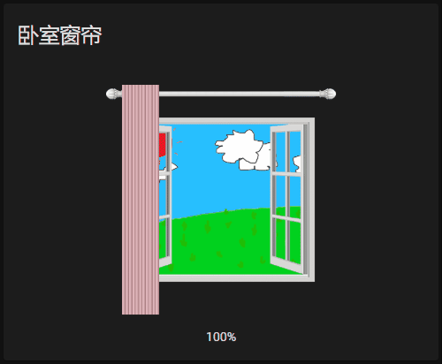
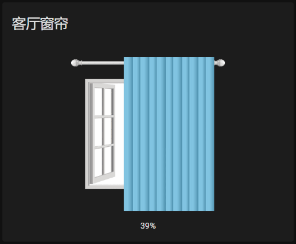
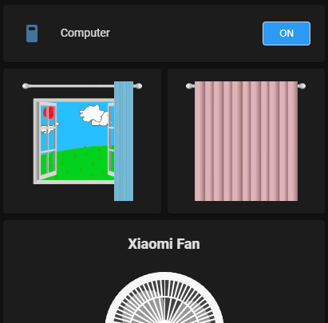

# Curtain Card

[](https://github.com/hacs/integration)
[](https://www.buymeacoffee.com/georgezhao2010)
[](https://github.com/georgezhao2010/lovelace-curtain-card/releases/latest)

[English](https://github.com/georgezhao2010/lovelace-curtain-card/blob/master/README.md) | 简体中文

Home Assistant Lovelace UI中使用的窗帘卡片，可以控制你的cover实体的电机。

适用于水平开启的窗帘，可以自定义窗帘打开方向，自定义窗外的景色图片。使用手/或者鼠标拖拽窗帘即可打开或者关闭窗帘，也可以拖拽到指定位置实现打开或者关闭指定的百分比。

# 安装

最简单的办法是在HACS中作为自定义仓库安装。

如果你不使用HACS，也可以按照以下方法进行手动安装。

将`dist/curtain-card.js`下载并复制到你的HomeAssistant的`/config/www/`目录中。

将如下配置加入"resources"配置项中，将路径改为你文件所在的具体位置。

```
  - url: /local/curtain-card.js
    type: module
```

# 卡片配置项
| 配置项 | 类型 | 必填 | 默认值 | 描述 |
| --- | --- | --- | --- | --- |
| entity | String | Yes | none | entity_id |
| type | String | Yes | none | custom:curtain-card |
| title | String | No | none | 卡片上显示的标题, 不设则不显示 |
| curtainColor | String | No | none | 窗帘颜色, 以4通道RGB表示 |
| direction | String | No | 'right' | 窗帘拉开方向 right\|left\|center |
| sceneImage | String | No | none | 窗外场景的图片URL |
| showStatus | Boolean | No | true | 是否在底部显示开闭百分比和打开关闭状态信息 |
| invertPercentage | Boolean | No | false | 百分比翻转 |
| size | Number | No | 260 | 窗帘的显示尺寸 |


## curtainColor 配置项

curtainColor用4通道RGB颜色表示，分别是红绿蓝及Alpha通道，Alpha应设置一定透明度以便显示窗帘的纹理，具体调整，可以根据家里窗帘颜色自己尝试。

## sceneImage 配置项

sceneImage图片最好是一个800x680比例的图片，推荐使用400x340分辨率的，可以是PNG/JPEG等，甚至是GIF动图。

## size 配置项

取值范围是100到800, 可以根据你的UI风格设置一个合适的值

# 示例
## 示例1

向左拉开的窗帘

```
type: custom:curtain-card
entity: cover.XXXXXXXX_motor
title: 卧室窗帘
curtainColor: rgb(200,60,80,0.3)
direction: left
```



## 示例2

自定义窗外景色图片的向右拉开的窗帘

```
type: custom:curtain-card
entity: cover.xxxxxxxx_motor
title: 客厅窗帘
curtainColor: rgb(26,160,220,0.5)
sceneImage: /local/images/2.gif
```



## 示例3

设置size值以便卡片可以水平堆叠显示

```
type: horizontal-stack
cards:
  - type: custom:curtain-card
    entity: cover.xxxxxxxx_motor
    curtainColor: rgb(26,160,220,0.5)
    size: 150
    showStatus: false
  - type: custom:curtain-card
    entity: cover.xxxxxxxx_motor
    curtainColor: rgb(200,60,80,0.3)
    direction: left
    size: 150
    showStatus: false
```


